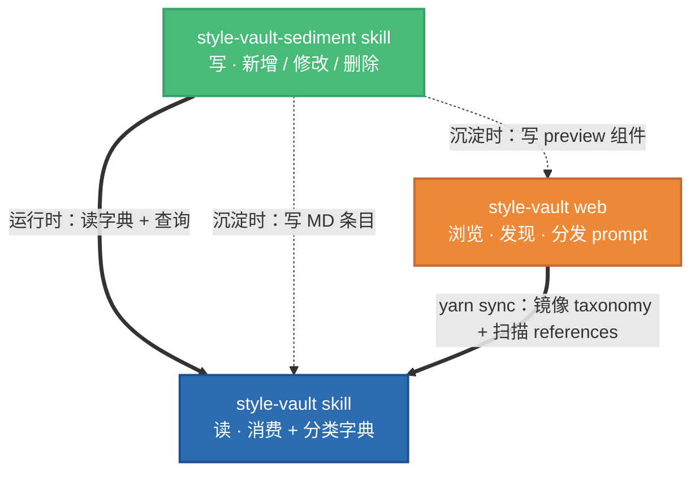

# Style Vault · 网站

**个人风格资产库 · 网站前端** · 浏览 / 筛选风格资产，复制 prompt 卡片分发到本地 AI 会话完成风格复刻。

---

## 三件套架构

style-vault 系统由三个相互协作的项目组成：



| 项目 | 类型 | 作用 |
|---|---|---|
| **style-vault skill** | Claude Code skill | AI 消费风格 + 查询分类字典 |
| **style-vault-sediment skill** | Claude Code skill | AI 沉淀 / 修改 / 删除风格 |
| **style-vault web**（本仓） | React + FastAPI 仓库 | 浏览网站 + prompt 卡片分发 |

---

## 安装

### 消费者（只是想用 vault 里的风格）

本网站和 [`style-vault` skill](https://github.com/garveyhu/awesome-skills/tree/main/style-vault) **是绑定的**——单装一边不 work。三步：

1. **装 `style-vault` skill** 到你 Claude Code 的 skills 目录（从 [awesome-skills](https://github.com/garveyhu/awesome-skills) 取 `style-vault/` 子目录）

2. **clone 本网站仓** 到本机任意位置：

   ```bash
   git clone https://github.com/garveyhu/style-vault.git
   ```

3. **编辑 `~/.agents/path.json`**（此路径是**硬约束**，写死在 skill 和 sync 脚本里，不能改），加入 `"style-vault"` 字段指向你 clone 下来的仓：

   ```json
   {
     "style-vault": "/absolute/path/to/style-vault"
   }
   ```

用法：浏览网站 → 复制 prompt 卡片 → 粘到本地 Claude Code（装了 skill 的）→ AI 复刻风格。

### 创作者（想往 vault 里加 / 改 / 删风格）

上述三步之外，再装**第二个 skill**：

4. **装 `style-vault-sediment` skill** 到同一个 skills 目录下（作为 `style-vault/` 的兄弟目录，从 awesome-skills 取 `style-vault-sediment/` 子目录）

然后在 Claude Code 里说"沉淀 xxx"就能触发写入流程。

## 快速开始（开发 / 自己跑起来）

```bash
# 前端
cd frontend
yarn install
yarn sync      # 从 skill 仓同步 taxonomy + 所有资产条目（必须 style-vault skill 已装）
yarn dev       # http://localhost:6001

# 后端（可选：要用登录/收藏才跑）
cd ../backend
./run.sh
```

### 常用命令

```bash
yarn sync                # 重新从 skill 仓同步（加新条目后必跑）
yarn dev                 # 启动 dev server
yarn build               # 生产构建
yarn tsc --noEmit        # 类型检查
yarn test --run          # 单元测试
```

---

## 目录结构

```
style-vault/
├── README.md                           本文件
├── docs/
│   ├── plans/                          设计稿 + 实施计划（YYYY-MM-DD-<topic>-design.md）
│   └── mockups/                        UI 方案对比 HTML（归档用）
├── frontend/
│   ├── package.json
│   ├── index.html
│   ├── src/
│   │   ├── App.tsx                     路由入口
│   │   ├── pages/                      页面组件
│   │   ├── components/                 共享组件（TopBar / StyleCard / ...）
│   │   ├── contexts/                   全局状态（Platform 等）
│   │   ├── auth/                       认证 + 收藏
│   │   ├── data/
│   │   │   ├── registry.json           ← yarn sync 产出（不手改）
│   │   │   └── taxonomy.json           ← yarn sync 产出（不手改）
│   │   ├── preview/                    每条资产的 preview 组件（动态加载）
│   │   ├── utils/
│   │   │   └── taxonomy.ts             taxonomy.json 的 TS wrapper
│   │   └── services/                   API 客户端
│   ├── scripts/
│   │   └── sync-from-skill/            yarn sync 的实现（扫 skill → 产出 registry+taxonomy）
│   └── tests/
└── backend/                            用户账号 + 收藏的后端（FastAPI + SQLite）
    ├── src/
    ├── migrations/                     Alembic 迁移
    ├── config/
    └── run.sh
```

---

## sync 机制

`yarn sync` 把 skill 仓当成**内容源头**，把本仓当成**渲染层**：

```
style-vault skill/
  ├── assets/taxonomy.json           ──复制──→  frontend/src/data/taxonomy.json
  ├── references/**/*.md             ──扫描──→  frontend/src/data/registry.json
  └── （不做其它写入）
```

skill 的具体路径由你 Claude Code 的配置决定，sync 脚本读约定的 `path.json` 定位。

每条 MD 的 frontmatter + 正文被解析成 JSON，前端直接 import 消费。**手改 `registry.json` / `taxonomy.json` 会在下次 sync 被覆盖**——要改数据请改 skill 仓或用 `style-vault-sediment` skill。

---

## 与其它两件的关系

### 读 `style-vault` skill

每次 `yarn sync` 都会：
- 读 skill 的 `assets/taxonomy.json` 做分类字典
- 扫 skill 的 `references/**/*.md` 构建 registry
- 校验所有 MD 的 frontmatter 合法（tag / category / platform / theme 必须在 taxonomy 里）

### 被 `style-vault-sediment` skill 写入

用户沉淀时（且满足 `VAULT_OK` 条件）：
- sediment skill 会写 `frontend/src/preview/<id>.tsx`（新 preview 组件）
- 触发 `yarn sync` 验证
- 写入网站仓一个 commit（`feat(preview): add ...`）

`VAULT_OK` 的判定：约定位置的 `path.json` 里有 `"style-vault"` 字段指向本仓，且 `frontend/package.json` 有 `"style-vault-site": true` marker。具体 path.json 位置见 sediment skill 的 `references/shared-workflow.md`。

---

## 相关链接

- 读 skill · [style-vault](https://github.com/garveyhu/awesome-skills/tree/main/style-vault)（消费者必装）
- 写 skill · [style-vault-sediment](https://github.com/garveyhu/awesome-skills/tree/main/style-vault-sediment)（仅创作者）
- [docs/plans/](docs/plans/) · 历次设计稿 + 实施计划
- [docs/mockups/](docs/mockups/) · UI 方案对比稿归档

---

## 常见问题

**Q: 为什么 `registry.json` / `taxonomy.json` 不手写？**
A: 它们是 build 产物，唯一真相是 skill 仓的 MD 文件 + `assets/taxonomy.json`。每次 `yarn sync` 都会覆盖。

**Q: 新增一个风格要改哪里？**
A: **不要**直接在这里改。去触发 `style-vault-sediment` skill：新对话里说"沉淀 xxx"，它会指引你完成双仓改动 + 合规校验。

**Q: 分类标签怎么加新值？**
A: 编辑 **style-vault skill 仓** 里的 `assets/taxonomy.json`，跑 `yarn sync`。前端会自动识别新值。

**Q: 为什么有 `data/registry.json` 又有 `data/taxonomy.json`？**
A: 两个职责：`taxonomy.json` 是**字典**（类型 / 分类 / tag / platform / theme 的枚举 + 中文 label），`registry.json` 是**数据**（所有资产条目的 frontmatter + 正文）。
